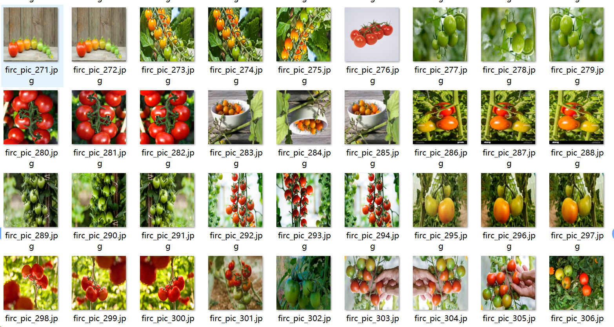

# Sweet Potato Detection Dataset (VOC+YOLO) in 1012 images with 3 classes

**Note:** The dataset contains approximately one-third original images and the remaining are rotationally augmented.

The dataset format follows Pascal VOC specifications, with additional YOLO format (without the segmentation path in a txt file, only containing jpg images, corresponding VOC XML files, and YOLO 
format txt files).

Number of images (jpg file count): 1012
Number of annotations (xml file count): 1012
Number of annotations (txt file count): 1012
Number of annotation categories: 3
Annotation category names (note that the order of categories in the YOLO format does not correspond to this, but is based on the labels folder's classes.txt): ["half-ripe", "not_ripe", "ripe"]

Each category has the following number of bounding boxes:
- half-ripe: 1975
- not_ripe: 2443
- ripe: 3674
Total bounding box count: 8092

Each category occupies the following number of images:
- half-ripe: 478
- not_ripe: 425
- ripe: 685

Image resolution: 640x640

Annotation tool used: labelImg

Annotation rules: draw bounding boxes for each category.

**Important Note:** The dataset does not include any split into training, validation, or test sets; you will need to manually divide it.

**Special Declaration:** This dataset does not guarantee the accuracy of the trained model or weight files.

**Image Preview:**

**Example of Annotation:**
## Images

Here is a pay link on Stripe ( https://buy.stripe.com/3cs8yP7sY87d0vu9AB ). Please contact me lonlonago@foxmail.com after funding $89, and I will send you a complete data files , thank you!

